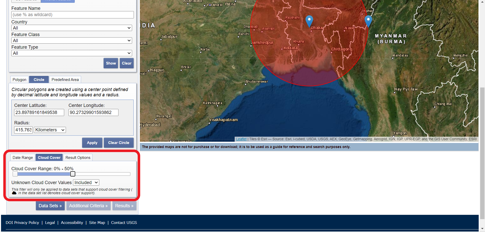

# 衛星データの取得方法(USGS編)

今回は、USGS EarthExplorerを利用して、BangladeshのMODIS Vegetation Index Productsをダウンロードする方法を紹介します。  
MODIS: NASAによって開発された可視・赤外域の放射計で、地球観測衛星のTerra、Aquaに搭載されている。  
Vegetation Index Products:  植物による光の反射の特徴を生かし、植生の状況を把握することを目的とした指標 

## USGS EarthExplorerに登録/ログインする

ユーザー登録をすることで、衛星画像データのダウンロードが可能になります。  

取得できるデータ  

+ MODIS(最新データ日時：2020年9月29日)  

## データを取得したい地域を設定する  

+ 特定の地点を含む衛星画像データを取得したい場合  

①【Geocoder】のタブで【World Features】を選択する.  
(米国内のデータを取得したい場合は、【US Features(デフォルト)】に設定)

②【Country】から【BANGLADESH】を選択 .  

③【Show】を押下すると、下図のような表が表示されるので、自分がデータを取得したい地点を選択する.
  

④地点を選択すると、下図のように右地図エリアにもポイントが表れる.
  

+ 広範囲の衛星画像データを取得したい場合  

**【Polygon】**　　

①【Polygon】を選択.  

②右地図エリアで、データを取得したい地域を囲うように各地点をクリックしていく.  

**【Circle】**

①【Circle】を選択 .    

②右地図エリアから適当に1地点をクリックする.データを取得したい地域に合わせて、もう1地点をクリックする.  

③【Apply】を押下.  

## データを取得したい日時を設定する  

【Date Range】から選択
(カレンダーから選択が可能)

## 雲の量を調整する  

【Cloud Cover】でバーを動かすことにより、設定が可能
＊ただし衛星データによっては雲量調整を行っていないものがあり、その場合は適用されない.  

## 【Data Sets】を押下  

##  必要なデータセットを選択する  

データセットの中から必要なデータセットを選択する  

今回は、冒頭のとおり、MODIS Vegetation Index Productsを選択します.  

＊データセット名の左のインフォメーションマークを押下すると説明が出る  

＊データセット名の左の地図マークを押下すると、そのデータのカバー範囲が右地図上に表示される  

## 【Results】を押下

## データのダウンロード  

+ 【Show Brouwse Overlay】を押下すると、各データを右地図上に表示することができる

＊複数のデータにわたる場合には、Acquisition Dateを確認する(データの詳細は【Show Mwtadata and Browse】から確認可能)  

+ 【Click here to export your results】の【Export data】を押下.  

+ 【Export name】,【Export file】を設定する.  

+  【Download】を押下. HDFファイルでのダウンロードとなる。 

