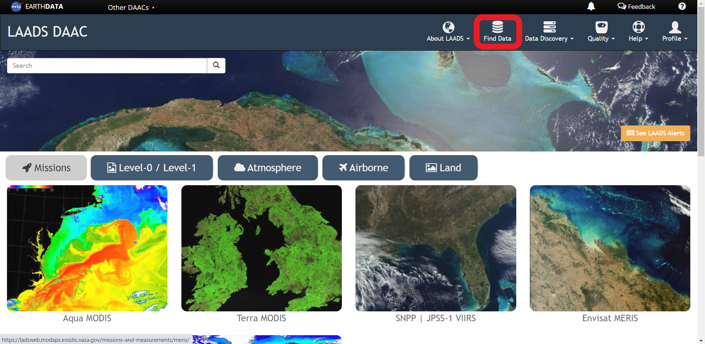
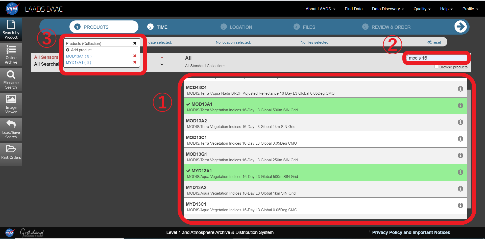
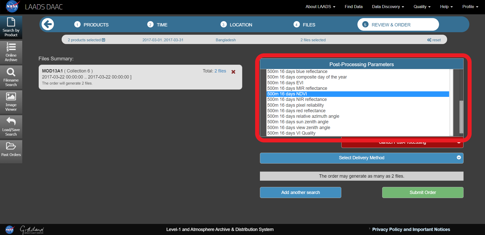
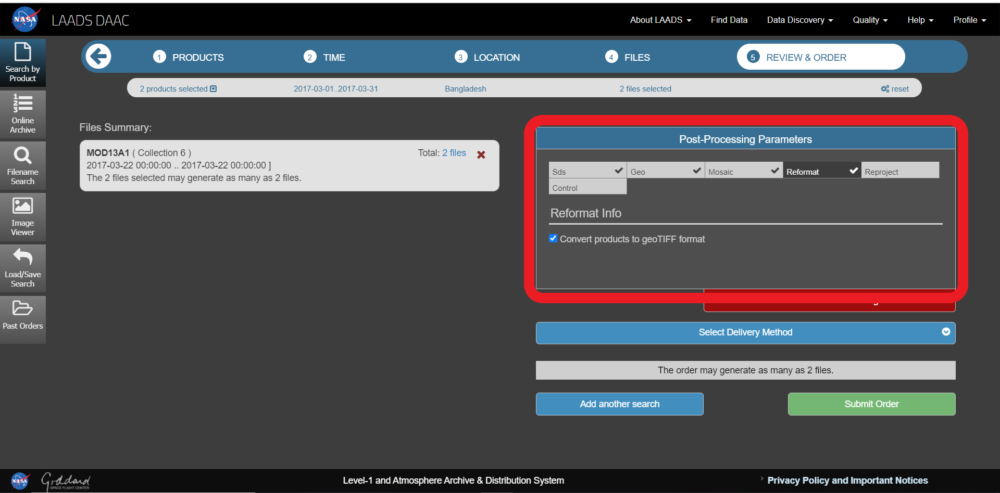

# 衛星データの取得方法(LAADS DAAC編)

今回は、LAADS DAACを利用して、BangladeshのMODIS Vegetation Index Productsをダウンロードする方法をご紹介します。

MODIS: NASAによって開発された可視・赤外域の放射計で、地球観測衛星のTerra、Aquaに搭載されている。  
Vegetation Index Products:  植物による光の反射の特徴を生かし、植生の状況を把握することを目的とした指標 

## LAADS DAACに登録/ログインする

## 【Find Data】を押す

## ①PRODUCTS：必要なデータを選択する  

ここではMOD13A1,MYD13A1を選択した。

## ②TIME：取得したいデータの日時を設定する

ここでは2017年3月1日から2017年3月31日を設定。

必ず【Add date】を押す。

## ③LOCATION：取得したいデータの地域を設定する

ここではバングラデシュを選択する。

【Countries】を押すと、国境が表示されるので、データを取得したい国を選択する。

そのほかにも、全世界や自分で地域を設定することも可能。

## ④FILES：表示されたファイルから必要なものを選択する

ここでファイルの左にある【Download】を押すとHDFファイルのダウンロードが可能。
GeoTIFF形式に変更したい場合は、以下の操作を行う。

## ⑤REVIEW&ORDER：ファイルの形式などを指定し、ダウンロードする

【Apply Post－Processing】を押す。

今回はNDVIのデータを取得できれば良いので、【SDs】を押し、【500m 16days NDVI】を選択する。

【Reformat】を押し、【Convert products to geoTIFF format】にチェックを入れる。

## 【Submit Order】を押す

5分程度で登録しているメールアドレスに"LAADS Web Order Notification"というタイトルのメールが届くので、文中のURLからダウンロードを行う。

