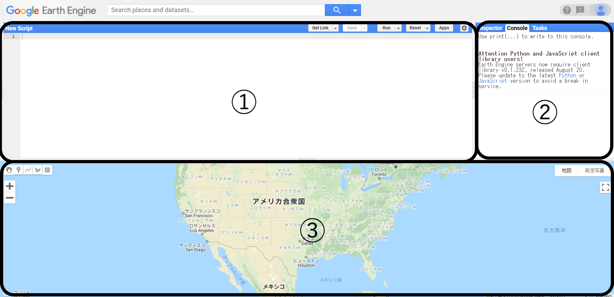
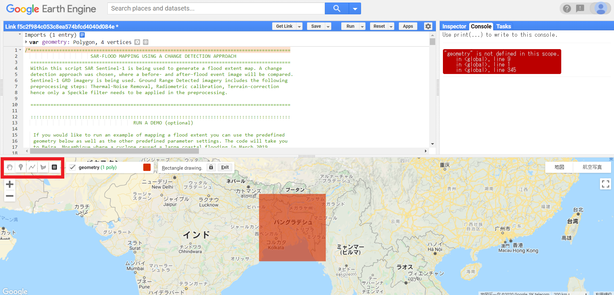
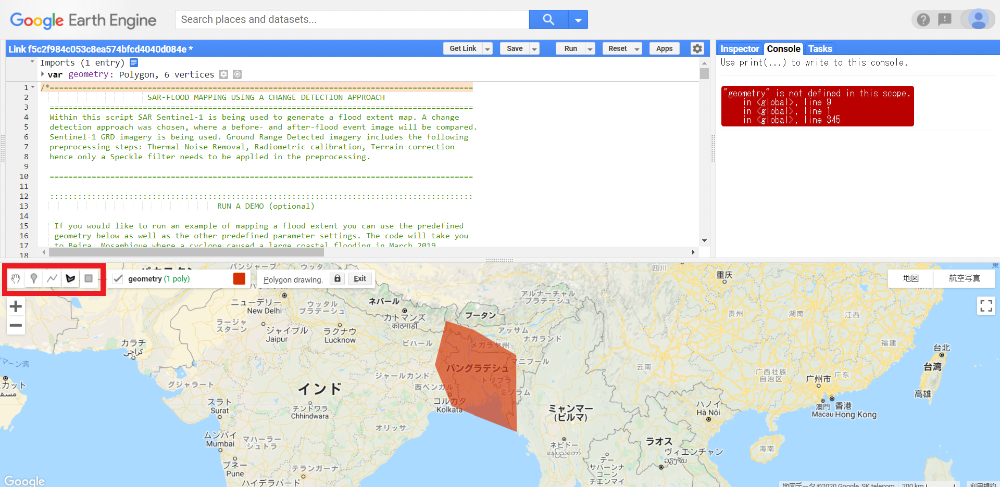

#  浸水マップの作成

洪水時の浸水状況を把握するためのマップを、Google earth engineを使って作成してみましょう。　　

## Google earth engineについて

Google earth engineとは、衛星画像をGoogleクラウド上で解析・利用できるサービス。　　
＊研究・教育・非営利目的ならば無料で利用可能。　　

Google earth engineは、以下の点で画期的と言われています。　　

+ 前処理済みデータ(ARD)を入手できる　　

+ 容量の大きなデータをダウンロードすることなく、解析することが可能　　

それでは早速、Google earth engineに登録してみましょう。　　

(Googleアカウントを所持していない場合)Googleアカウントを登録する　　

Google earth engineの【Sign up】タブからログイン　

## GEE CODE EDITORの使用　　

①コードの入力画面　　

②　　

③　地図や結果の表示画面　　

## GEE code editorで浸水マップを作成する　　

参考：UN Spider(https://un-spider.org/advisory-support/recommended-practices/recommended-practice-google-earth-engine-flood-mapping/step-by-step)  

今回の浸水マップ作成に当たっては、以下のコードを使用しました。基本的なコードは以下のURLのものと同じなので、今回は研究内容によって変更する項目について説明します。

### 対象エリアの設定  

①地図上のツールバーの一番右(■)をクリックする。研究対象エリアを四角形で囲むことができる。

②地図上のツールバーの右から2番目(5角形)をクリックする。研究対象エリアにピンを立て、必要最低限のエリアを選択することが可能。　　

### 対象日時の設定　　
　
洪水前後の日時を設定する。　　

＊使用するデータはSentinel-1で16日周期であることに留意。

### 各種設定

変更なし

