--- 
title: "衛星BASIC"
author: "Tamaki.M"
date: "`r Sys.Date()`"
site: bookdown::bookdown_site
documentclass: book
bibliography: [book.bib, packages.bib]
biblio-style: apalike
link-citations: yes
description: "衛星データ初心者の方向けに、衛星データのいろはをお伝えします！"
---

# 初めに {-}

## なぜ今、リモートセンシングが注目を集めているのか

## リモートセンシングデータ活用事例

## 作業環境

2020年10月現在  
Windows 10 64bit  
QGIS 3.14.16  

<!--chapter:end:index.Rmd-->

# 事前準備

## 衛星データの種類

## 衛星データをダウンロードできるサイト

+ USGS EarthExplorer  
(https://earthexplorer.usgs.gov/)  
アメリカ地質調査所(USGS)が衛星画像データを無償で提供しているサイト　　

+ EO Browser
(https://www.sentinel-hub.com/explore/eobrowser/)     
Sinergiseが衛星データを無償で提供しているサイト。ブラウザ上で、解析や計測を行うことも可能。

+ LAADS DAAC
(https://ladsweb.modaps.eosdis.nasa.gov/) 
NASAが衛星データを無償提供しているサイト。

<!--chapter:end:01-intro.Rmd-->

# 衛星データの取得方法(USGS編)

今回は、USGS EarthExplorerを利用して、BangladeshのMODIS Vegetation Index Productsをダウンロードする方法を紹介します。  
MODIS: NASAによって開発された可視・赤外域の放射計で、地球観測衛星のTerra、Aquaに搭載されている。  
Vegetation Index Products:  植物による光の反射の特徴を生かし、植生の状況を把握することを目的とした指標 

## USGS EarthExplorerに登録/ログインする

ユーザー登録をすることで、衛星画像データのダウンロードが可能になります。  

取得できるデータ  

+ MODIS(最新データ日時：2020年9月29日)
## データを取得したい地域を設定する  

+ 特定の地点を含む衛星画像データを取得したい場合  

①【Geocoder】のタブで【World Features】を選択する.  
(米国内のデータを取得したい場合は、【US Features(デフォルト)】に設定)

②【Country】から【BANGLADESH】を選択 .  
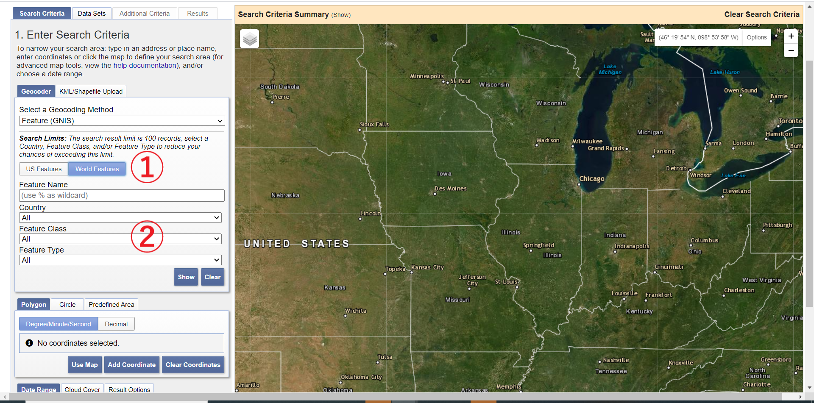
③【Show】を押下すると、下図のような表が表示されるので、自分がデータを取得したい地点を選択する.
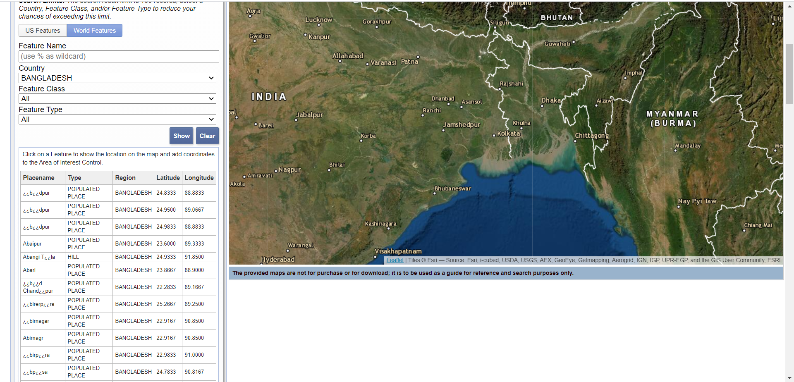  

④地点を選択すると、下図のように右地図エリアにもポイントが表れる.
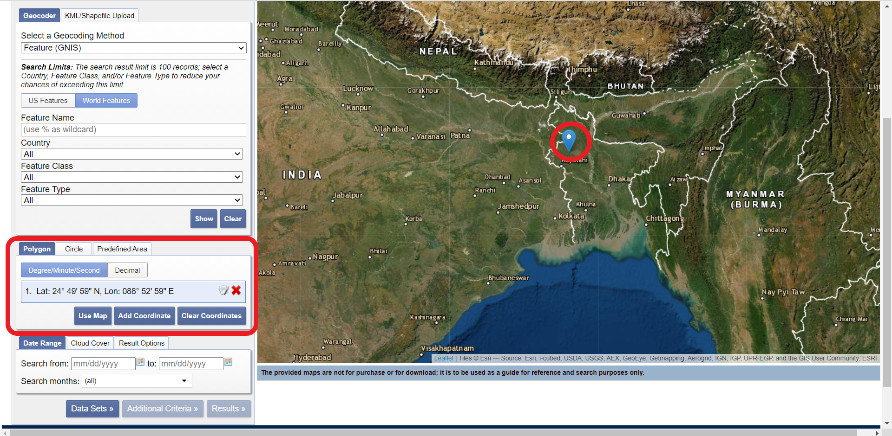  

+ 広範囲の衛星画像データを取得したい場合  

**【Polygon】**　　

①【Polygon】を選択.  

②右地図エリアで、データを取得したい地域を囲うように各地点をクリックしていく.  
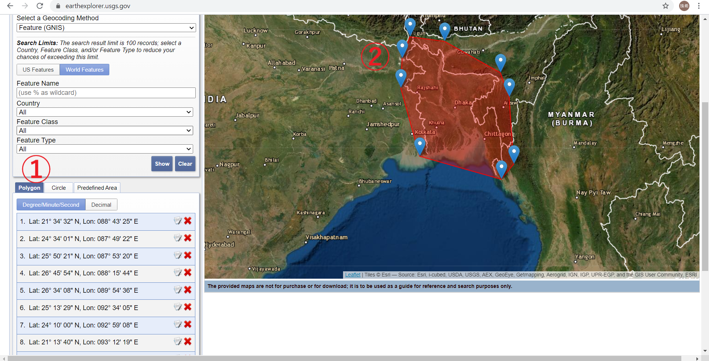

**【Circle】**

①【Circle】を選択 .    

②右地図エリアから適当に1地点をクリックする.データを取得したい地域に合わせて、もう1地点をクリックする.  
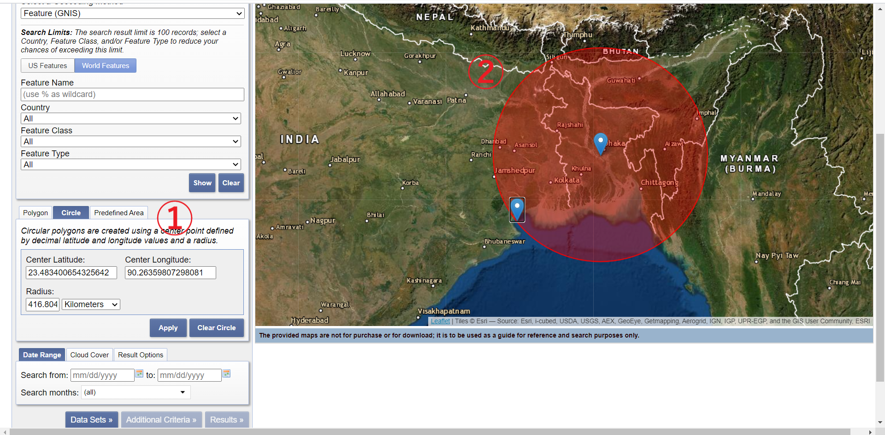
③【Apply】を押下.  

## データを取得したい日時を設定する  

【Date Range】から選択
(カレンダーから選択が可能)
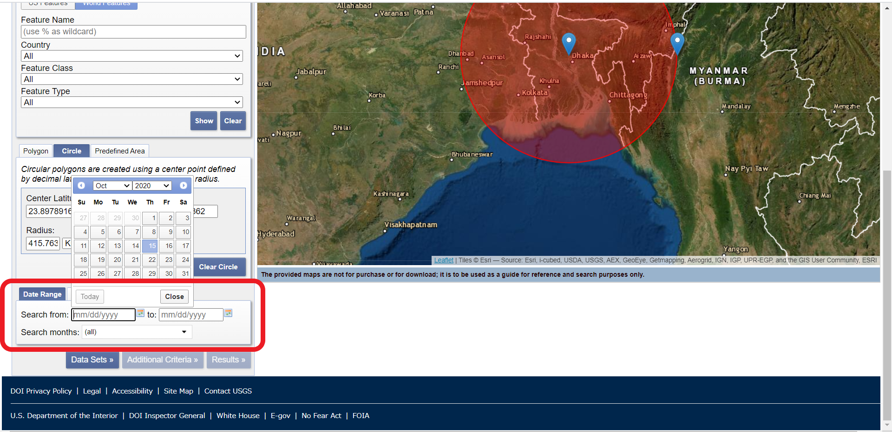

## 雲の量を調整する  

【Cloud Cover】でバーを動かすことにより、設定が可能
＊ただし衛星データによっては雲量調整を行っていないものがあり、その場合は適用されない.  
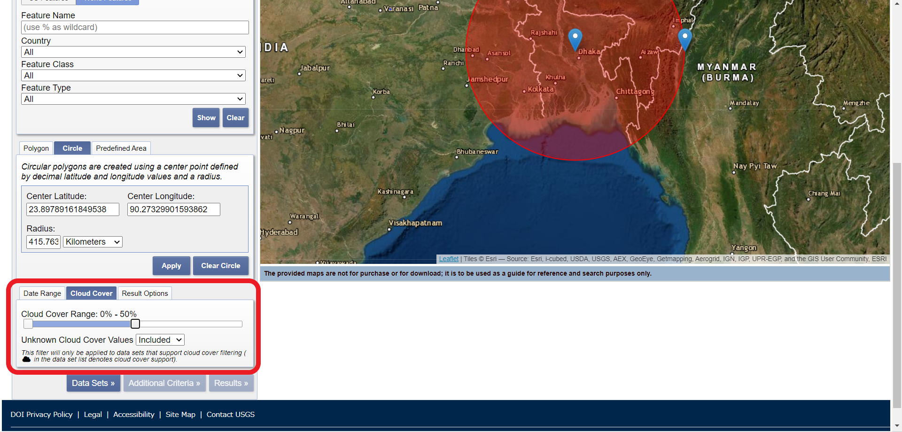

## 【Data Sets】を押下  

##  必要なデータセットを選択する  

データセットの中から必要なデータセットを選択する  

今回は、冒頭のとおり、MODIS Vegetation Index Productsを選択します.  

＊データセット名の左のインフォメーションマークを押下すると説明が出る  

＊データセット名の左の地図マークを押下すると、そのデータのカバー範囲が右地図上に表示される  
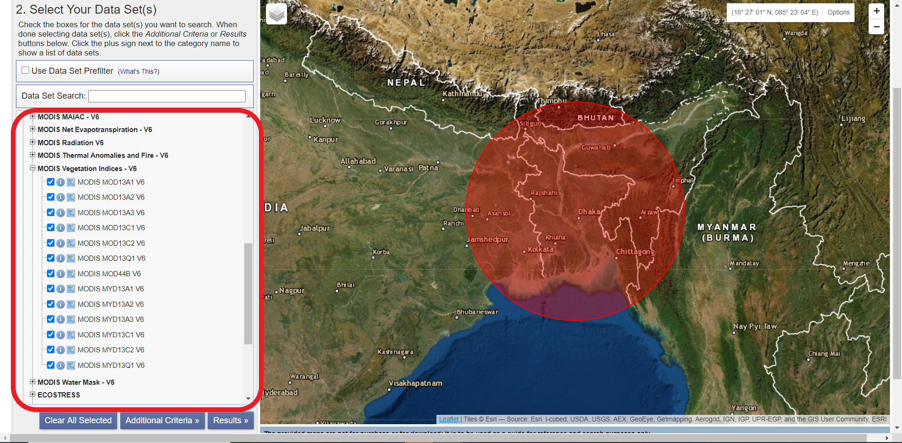

## 【Results】を押下

## データのダウンロード  

+ 【Show Brouwse Overlay】を押下すると、各データを右地図上に表示することができる
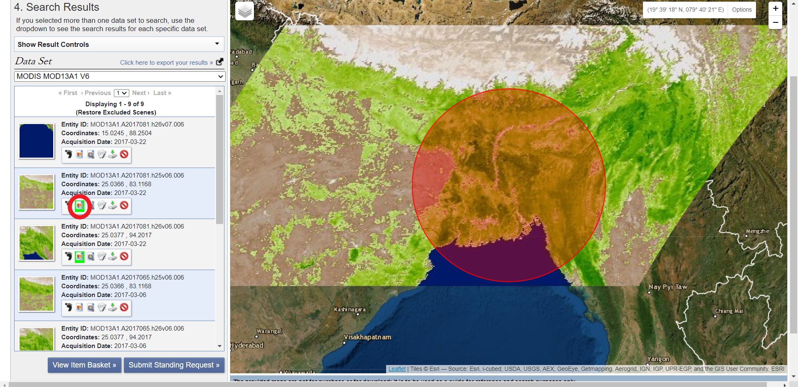

＊複数のデータにわたる場合には、Acquisition Dateを確認する(データの詳細は【Show Mwtadata and Browse】から確認可能)  

+ 【Click here to export your results】の【Export data】を押下.  
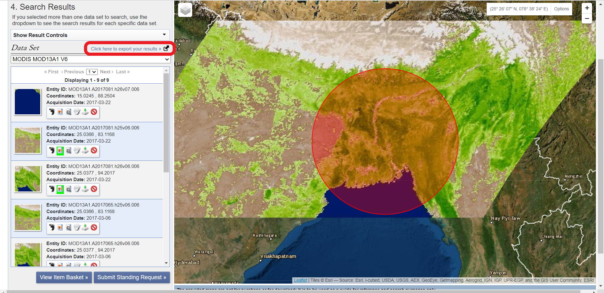

+ 【Export name】,【Export file】を設定する.  

+  【Download】を押下. HDFファイルでのダウンロードとなる。 
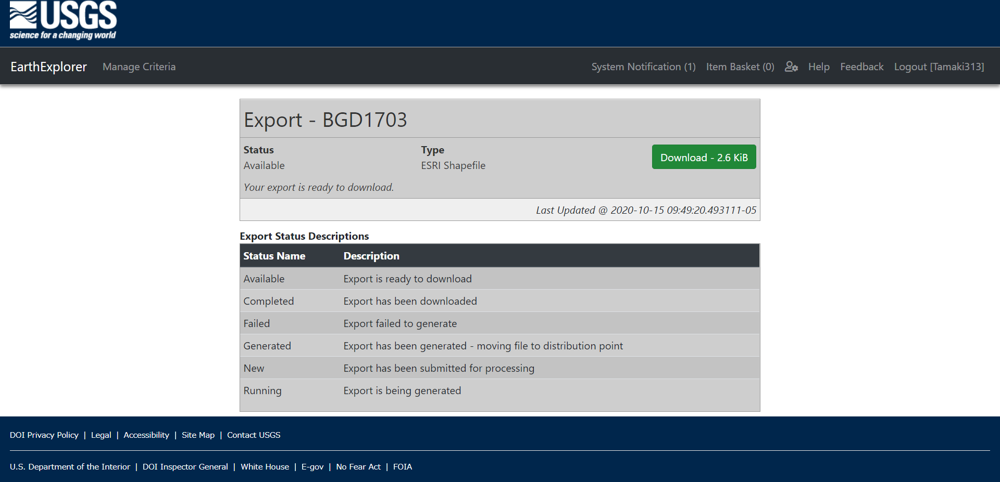

<!--chapter:end:02-literature.Rmd-->

# 衛星データの取得方法(LAADS DAAC編)

今回は、LAADS DAACを利用して、BangladeshのMODIS Vegetation Index Productsをダウンロードする方法をご紹介します。

MODIS: NASAによって開発された可視・赤外域の放射計で、地球観測衛星のTerra、Aquaに搭載されている。  
Vegetation Index Products:  植物による光の反射の特徴を生かし、植生の状況を把握することを目的とした指標 

## LAADS DAACに登録/ログインする

LAADS DAACから取得できるデータ　　

+ MODIS(最新データ日時：2020年9月29日) 　

+ AVHRR  

+ ESA copernics-sentinel-3 

+ MERIS  

+ VIIRS  

## 【Find Data】を押す

## ①PRODUCTS：必要なデータを選択する  

ここではMOD13A1,MYD13A1を選択した。
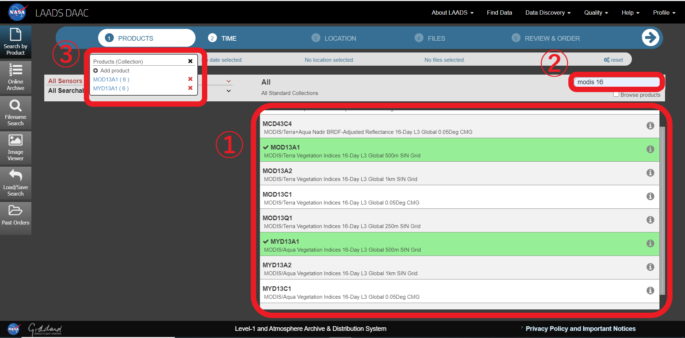

## ②TIME：取得したいデータの日時を設定する

ここでは2017年3月1日から2017年3月31日を設定。

必ず【Add date】を押す。
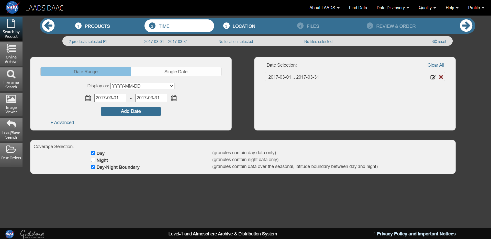

## ③LOCATION：取得したいデータの地域を設定する

ここではバングラデシュを選択する。

【Countries】を押すと、国境が表示されるので、データを取得したい国を選択する。

そのほかにも、全世界や自分で地域を設定することも可能。
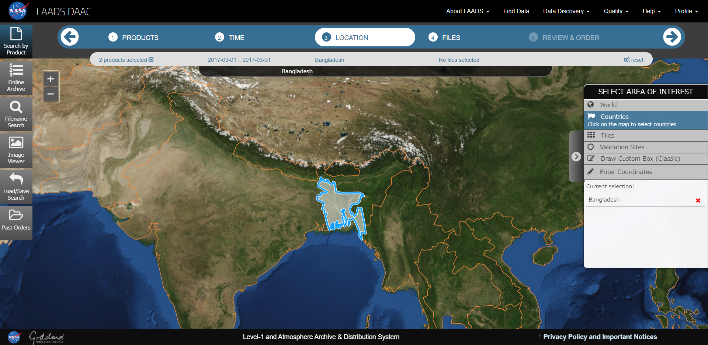

## ④FILES：表示されたファイルから必要なものを選択する

ここでファイルの左にある【Download】を押すとHDFファイルのダウンロードが可能。
GeoTIFF形式に変更したい場合は、以下の操作を行う。

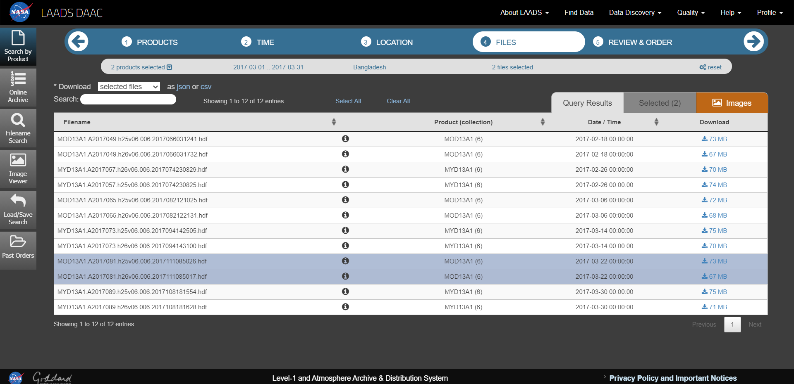

## ⑤REVIEW&ORDER：ファイルの形式などを指定し、ダウンロードする

【Apply Post－Processing】を押す。

今回はNDVIのデータを取得できれば良いので、【SDs】を押し、【500m 16days NDVI】を選択する。
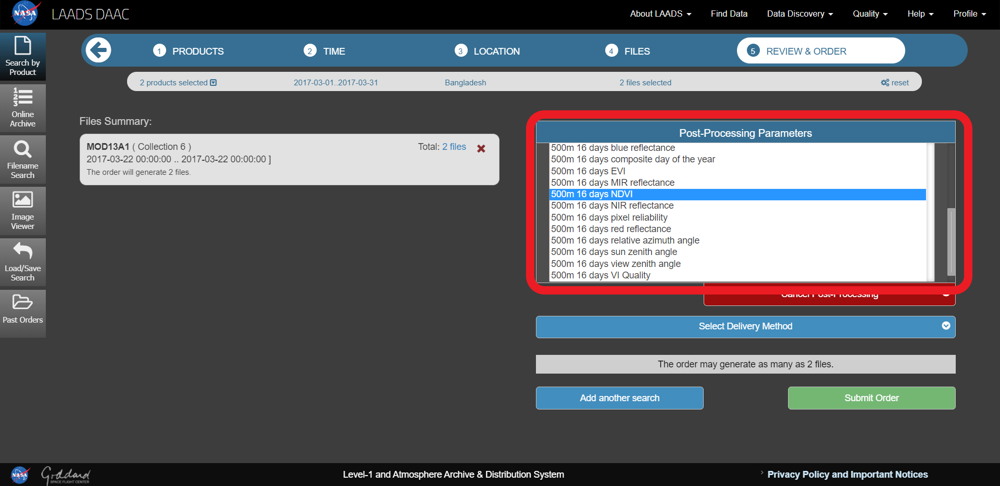

【Reformat】を押し、【Convert products to geoTIFF format】にチェックを入れる。
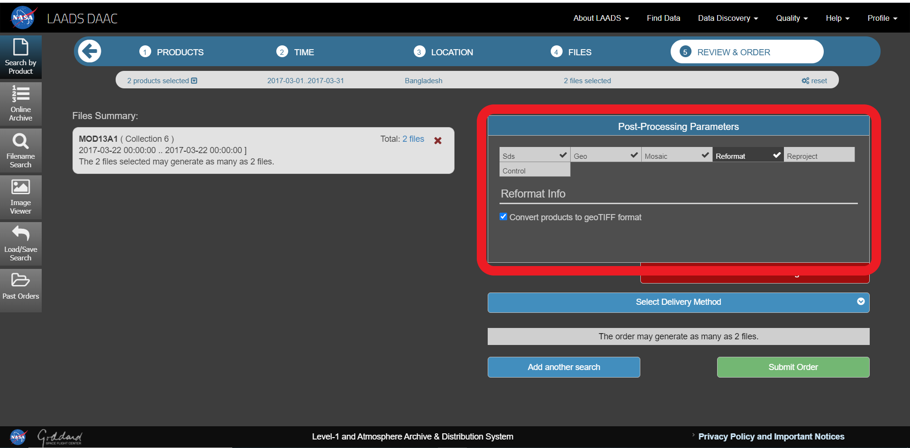

## 【Submit Order】を押す

5分程度で登録しているメールアドレスに"LAADS Web Order Notification"というタイトルのメールが届くので、文中のURLからダウンロードを行う。

<!--chapter:end:03-method.Rmd-->

# Applications

Some _significant_ applications are demonstrated in this chapter.

## Example one

## Example two

<!--chapter:end:04-application.Rmd-->

# Final Words

We have finished a nice book.

<!--chapter:end:05-summary.Rmd-->

`r if (knitr::is_html_output()) '
# References {-}
'`

<!--chapter:end:06-references.Rmd-->

